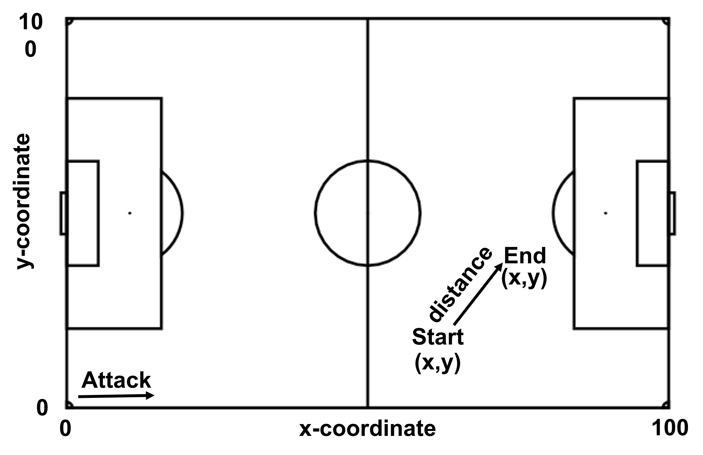

```{r setup, include=FALSE}
# some of common options (and the defaults) are: 
# include=T, eval=T, echo=T, results='hide'/'asis'/'markup',..., collapse=F, warning=T, message=T, error=T, cache=T, fig.width=6, fig.height=4, fig.dim=c(6,4) #inches, fig.align='left'/'center','right', 
library(ezids)
library(ggplot2)
library(ggsoccer)
library(ggpubr)
library(dplyr)
library(vtable)
library(purrr)
library(pROC)
library(regclass)
library(car)
library(corrplot)
library(pls)
library(mice)
library(ISLR)
library(leaps)
library(caret)
require(nnet)
library(cvms)
library(tibble)
library(ggimage)
library(rsvg)
library(ggnewscale)
library(sjPlot)
library(sjmisc)
library(sjlabelled)
pacman::p_load(ezids, ggplot2, ggsoccer, ggpubr, dplyr, vtable, readr, stats, tidyverse, tidyr)
# knitr::opts_chunk$set(warning = F, results = "markup", message = F)
knitr::opts_chunk$set(warning = F, results = "markup", message = F, echo=F)
options(scientific=T, digits = 3) 
# options(scipen=9, digits = 3) 
# ‘scipen’: integer. A penalty to be applied when deciding to print numeric values in fixed or exponential notation.  Positive values bias towards fixed and negative towards scientific notation: fixed notation will be preferred unless it is more than ‘scipen’ digits wider.
# use scipen=999 to prevent scientific notation at all times
```

# Modelling Shot Success Rate and Win Probabilities in Soccer


```{r load data}
# Load and prep event data
england<-data.frame(read.csv('./datasets/event_England.csv'))
england$competition <- "England"

italy<-data.frame(read.csv('./datasets/event_Italy.csv'))
italy$competition <- "Italy"

germany<-data.frame(read.csv('./datasets/event_Germany.csv'))
germany$competition <- "Germany"

france<-data.frame(read.csv('./datasets/event_France.csv'))
france$competition <- "France"

spain<-data.frame(read.csv('./datasets/event_Spain.csv'))
spain$competition <- "Spain"

european<-data.frame(read.csv('./datasets/event_European_Championship.csv'))
european$competition <- "European"

worldcup<-data.frame(read.csv('./datasets/event_World_Cup.csv'))
worldcup$competition <- "World Cup"
                     
#Append dataframes into a single dataframe from which to draw.
event_data<-rbind(england, italy, germany, france, spain, european, worldcup)

#convert x and y coordinate columns from characters to integer values
event_data$x.End <- as.numeric(event_data$x.End)
event_data$y.End <- as.numeric(event_data$y.End)

event_data$x.Start <- as.numeric(event_data$x.Start)
event_data$y.Start <- as.numeric(event_data$y.Start)

#convert event, subevent, tags, players, team labels, etc... to factors
event_data$Event.Name=as.factor(event_data$Event.Name)
event_data$Subevent.Name=as.factor(event_data$Subevent.Name)
event_data$Match.Period=as.factor(event_data$Match.Period)
event_data$Match.Id=as.factor(event_data$Match.Id)
event_data$Player=as.factor(event_data$Player)
event_data$Team=as.factor(event_data$Team)
event_data$Tag.1=as.factor(event_data$Tag.1)
event_data$Tag.2=as.factor(event_data$Tag.2)
event_data$Tag.3=as.factor(event_data$Tag.3)
event_data$Tag.4=as.factor(event_data$Tag.4)
event_data$Tag.5=as.factor(event_data$Tag.5)
event_data$Tag.6=as.factor(event_data$Tag.6)

# Calculate and add event distance variable
event_data<-event_data %>% mutate(dist = sqrt((x.End-x.Start)^2+(y.End-y.Start)^2))
event_data$dist <- as.numeric(event_data$dist)

#Collect shots, goals, assists, and key passes into their own data frames
shots<-subset(event_data, Event.Name=='Shot')
shots<-subset(shots, Tag.1!='Goal')
goals<-subset(event_data, Tag.1=='Goal')
goals<-subset(goals, Event.Name!='Save attempt')
assists<-subset(event_data, Tag.1=='Assist')
key_passes<-subset(event_data, Tag.1=='Key pass')

# Load and prep match summary data
match_summary <- data.frame(read.csv('./datasets/match_summary.csv'))
```

## Chapter 1: Introduction
Soccer is the most watched sport in the world and is a business for teams worth hundreds of millions of dollars. In fact, 43% of the sports viewers in the World are interested in watching soccer, compared to 37% from Basketball viewers; and the FIFA World Cup Media rights income budgeted a whopping total of $3.0 billion USD for this event alone. (Nielson Sports, 2018) As a result, clubs put a great deal of time and resources towards achieving success. This includes collecting ever increasing amounts of data about their team’s performances and those of others. Unfortunately, most of these data sets are not publicly available. There are still small data sets that have become publicly available, such as this one obtained by Luca Pappalardo on Figshare. From this small data set we hope to gain some insight into the game and an understanding of how data is coming to be used in soccer. 

## Chapter 2: Data Set Overview
The dataset contains all matches played in Europe’s top five leagues during the 2017/2018 season (380 matches per league for a total of 1900 matches, producing 643,149 match events), the 2016 European Championship (51 matches, producing 78,139 match events), and the 2018 World Cup (64 matches, 101,758 match events). The data was imported by league and then compiled into a single data frame, giving a total of 3,251,294 events and 19 variables. This data was originally released by Wyscout.

One variable we are interested in looking at is the distance of assists and key passes and whether this plays a role in the success of the pass and whether it results in a successful shot on goal or not. We have to calculate distance for each event using the x,y-coordinates given in the data set. To do this we assumed field dimensions of 120 yards in length of 75 yards wide. This is the average size of a soccer pitch. We then are able to calculate event distances in yards instead of percentages. If the x and y coordinates in percentage were used we'd get a distorted distance since in reality a soccer field is not square. In this report x & y-coordinates are displayed as percentages, while event distance is displayed in yards so results are not distorted.

## Chapter 3: Event Vizualization

### 3.1 Understanding the Field
To understand our data, we needed to first understand how the field is set up. The field is set up so that the length is given by the x-coordinate, and the width is given by the y-coordinate. Each coordinate is given as a percentage. Events are always oriented so that the attacking team is going from left to right.


**Figure 1.** Pitch schematic showing direction of attack and event x,y-coordinate example.

### 3.2 Event Visualization

#### 3.2.1 Visualizing Field Locations
Using the ggsoccer library to plot event data on an image of a pitch and bordering the x and y axis with event density plots we were quickly able to understand how each event is distributed on the pitch, shown in Figure 2. Several observations can be made from this visualization. First, the x & y-coordinates for both key passes and assists are multimodal and appear to be symmetric across the y=50 line. This makes sense as teams try to attack down both sides of the field. With this data being an average over so many games getting a symmetric split between the two sides of the field is expected. This symmetry could be a factor that varies from team to team, however. Second, the x & y-coordinate distributions for shots and goals is much closer to normal. The exception being the x-coordinate for shots which is bimodal. This is interesting because it indicates that a significant portion of shots are taken farther away from goal, however, very few goals are scored from these shots. Despite this, players still seem to take these shots. 
  
```{r plot events on soccer pitch}
shots_fig<-ggplot(shots)+
  annotate_pitch()+
  geom_point(aes(x=x.Start, y=y.Start))+
  #scale_color_continuous(color='reds')+
  #geom_point(aes(x=x.Start, y=y.Start))+
  theme_pitch()+
  theme(plot.margin = unit(c(-0.5,-0.5,-0.5,-0.5), 'cm'))

goals_fig<-ggplot(goals)+
  annotate_pitch()+
  geom_point(aes(x=x.Start, y=y.Start))+
  theme_pitch()+
  theme(plot.margin = unit(c(-0.5,-0.5,-0.5,-0.5), 'cm'))

key_passes_fig<-ggplot(key_passes)+
  annotate_pitch()+
  geom_point(aes(x=x.Start, y=y.Start))+
  theme_pitch()+
  theme(plot.margin = unit(c(-0.5,-0.5,-0.5,-0.5), 'cm'))

assists_fig<-ggplot(assists)+
  annotate_pitch()+
  geom_point(aes(x=x.Start, y=y.Start))+
  theme_pitch()+
  theme(plot.margin = unit(c(-0.5,-0.5,-0.5,-0.5), 'cm'))
```

```{r density plots for pitch event plots}
key_passes_histx<-ggplot()+
  geom_density(data=(key_passes), aes(x=x.Start, y=..density..), color='Black', fill='Gold', alpha=0.3)+
  scale_x_continuous(limits = c(0,100))+
  theme(panel.background=element_blank(),
        panel.grid.major = element_blank(),
        panel.grid.minor = element_blank(),
        axis.title = element_blank(),
        axis.text = element_blank(),
        axis.ticks = element_blank(),
        plot.margin = unit(c(0,0,-0.5,-0.1), 'cm'))

key_passes_histy<-ggplot()+
  geom_density(data=(key_passes), aes(x=y.Start, y=..density..), color='Black', fill='Gold', alpha=0.3)+
  scale_x_continuous(limits = c(0,100))+
  theme(panel.background=element_blank(),
        panel.grid.major = element_blank(),
        panel.grid.minor = element_blank(),
        axis.title = element_blank(),
        axis.text = element_blank(),
        axis.ticks = element_blank(),
        plot.margin = unit(c(0,0,0.1,-0.5), 'cm'))+
  rotate()

assists_histx<-ggplot()+
  geom_density(data=(assists), aes(x=x.Start, y=..density..), color='Black', fill='Green', alpha=0.3)+
  scale_x_continuous(limits = c(0,100))+
  theme(panel.background=element_blank(),
        panel.grid.major = element_blank(),
        panel.grid.minor = element_blank(),
        axis.title = element_blank(),
        axis.text = element_blank(),
        axis.ticks = element_blank(),
        plot.margin = unit(c(0,0,-0.5,-0.1), 'cm'))

assists_histy<-ggplot()+
  geom_density(data=(assists), aes(x=y.Start, y=..density..), color='Black', fill='Green', alpha=0.3)+
  scale_x_continuous(limits = c(0,100))+
  theme(panel.background=element_blank(),
        panel.grid.major = element_blank(),
        panel.grid.minor = element_blank(),
        axis.title = element_blank(),
        axis.text = element_blank(),
        axis.ticks = element_blank(),
        plot.margin = unit(c(0,0,0.1,-0.5), 'cm'))+
  rotate()

shots_histx<-ggplot()+
  geom_density(data=(shots), aes(x=x.Start, y=..density..), color='Black', fill='Red', alpha=0.3)+
  scale_x_continuous(limits = c(0,100))+
  theme(panel.background=element_blank(),
        panel.grid.major = element_blank(),
        panel.grid.minor = element_blank(),
        axis.title = element_blank(),
        axis.text = element_blank(),
        axis.ticks = element_blank(),
        plot.margin = unit(c(0,0,-0.5,-0.1), 'cm'))


shots_histy<-ggplot()+
  geom_density(data=(shots), aes(x=y.Start, y=..density..), color='Black', fill='Red', alpha=0.3, ylim=c(0,100))+
  scale_x_continuous(limits = c(0,100))+
  theme(panel.background=element_blank(),
        panel.grid.major = element_blank(),
        panel.grid.minor = element_blank(),
        axis.title = element_blank(),
        axis.text = element_blank(),
        axis.ticks = element_blank(),
        plot.margin = unit(c(0,0,0.1,-0.5), 'cm'))+
  rotate()

goals_histx<-ggplot()+
  geom_density(data=(goals), aes(x=x.Start, y=..density..), color='Black', fill='Blue', alpha=0.3)+
  scale_x_continuous(limits = c(0,100))+
  theme(panel.background=element_blank(),
        panel.grid.major = element_blank(),
        panel.grid.minor = element_blank(),
        axis.title = element_blank(),
        axis.text = element_blank(),
        axis.ticks = element_blank(),
        plot.margin = unit(c(0,0,-0.5,-0.1), 'cm'))

goals_histy<-ggplot()+
  geom_density(data=(goals), aes(x=y.Start, y=..density..), color='Black', fill='Blue', alpha=0.3, ylim=c(0,100))+
  scale_x_continuous(limits = c(0,100))+
  theme(panel.background=element_blank(),
        panel.grid.major = element_blank(),
        panel.grid.minor = element_blank(),
        axis.title = element_blank(),
        axis.text = element_blank(),
        axis.ticks = element_blank(),
        plot.margin = unit(c(0,0,0.1,-0.5), 'cm'))+
  rotate()
```

```{r pitch+hist plots, fig.show='hold', out.width='50%'}
key_pass_dist_pitch<-ggarrange(key_passes_histx, NULL, key_passes_fig, key_passes_histy,
          ncol=2, nrow=2,
          widths=c(2,1), heights=c(1,2)) %>%
  annotate_figure(top=text_grob('Key Pass Distribution', face='bold', size=20))

assist_dist_pitch<-ggarrange(assists_histx, NULL, assists_fig, assists_histy,
          ncol=2, nrow=2,
          widths=c(2,1), heights=c(1,2)) %>%
  annotate_figure(top=text_grob('Assist Distribution', face='bold', size=20))

shot_dist_pitch<-ggarrange(shots_histx, NULL, shots_fig, shots_histy,
          ncol=2, nrow=2,
          widths=c(2,1), heights=c(1,2)) %>%
  annotate_figure(top=text_grob('Shot Distribution', face='bold', size=20))

goal_dist_pitch<-ggarrange(goals_histx, NULL, goals_fig, goals_histy,
          ncol=2, nrow=2,
          widths=c(2,1), heights=c(1,2)) %>%
  annotate_figure(top=text_grob('Goal Distribution', face='bold', size=20))

key_pass_dist_pitch
assist_dist_pitch
shot_dist_pitch
goal_dist_pitch
```
**Figure 2.** Event field locations and x & y-coordinate density plots for (Top Left) Key Passes, (Top Right) Assists, (Bottom Left) Shots, and (Bottom Right) Goals.

#### 3.2.2 Event Distance Distributions
The distance distributions for key passes and assists are displayed in Figure 3. Both show fairly normal distributions, despite the fact that neither the x,y-coordinates for these two events show normal distributions. The distances of shots and goals were not examined as the x & y end coordinates given in the dataset were found to be inaccurate.

```{r event distance distribution, fig.show='hold', out.width='50%'}
key_pass_dist<-ggplot()+
  geom_density(data=key_passes, aes(x=dist, y=..density..), color='Black', fill='Gold', alpha=0.3)+
  xlim(c(0,150))+
  labs(title="Key Pass Distances", x="Distance", y="", )+
  theme(panel.background = element_blank(),
        panel.border=element_rect(color='black', fill=NA),
        axis.text.x = element_text(size=16),
        axis.text.y = element_blank(),
        axis.ticks.y = element_blank(),
        axis.title = element_text(size=16),
        plot.title = element_text(size=20, hjust = 0.5))

assist_dist<-ggplot()+
  geom_density(data=assists, aes(x=dist, y=..density..), color='Black', fill='Green', alpha=0.3)+
  xlim(c(0,150))+
  labs(title="Assist Distances", x="Distance", y="")+
  theme(panel.background = element_blank(),
        panel.border=element_rect(color='black', fill=NA),
        axis.text.x = element_text(size=16),
        axis.text.y = element_blank(),
        axis.ticks.y = element_blank(),
        axis.title = element_text(size=16),
        plot.title = element_text(size=20, hjust = 0.5))

shot_dist<-ggplot()+
  geom_density(data=shots, aes(x=dist, y=..density..), color='Black', fill='Red', alpha=0.3)+
  xlim(c(0,150))+
  labs(title="Shot Distances", x="Distance (yards)", y="")+
  theme(panel.background = element_blank(),
        panel.border=element_rect(color='black', fill=NA),
        axis.text.x = element_text(size=16),
        axis.text.y = element_blank(),
        axis.ticks.y = element_blank(),
        axis.title = element_text(size=16),
        plot.title = element_text(size=20, hjust = 0.5))

goal_dist<-ggplot()+
  geom_density(data=goals, aes(x=dist, y=..density..), color='Black', fill='Blue', alpha=0.3)+
  xlim(c(0,150))+
  labs(title="Goal Distances", x="Distance (yards)", y="")+
  scale_color_manual(name='Key',values=c('Green', 'Red'), labels=c('Assists','Key Passes'))+
  theme(panel.background = element_blank(),
        panel.border=element_rect(color='black', fill=NA),
        axis.text.x = element_text(size=16),
        axis.text.y = element_blank(),
        axis.ticks.y = element_blank(),
        axis.title = element_text(size=16),
        plot.title = element_text(size=20, hjust = 0.5))

key_pass_dist
assist_dist
```
**Figure 3.** Event distance for (Left)  Key Passes and (Right) Assists.

## Chapter 4: Determining Goal Probabilities

### Given the variables that describe the (X, Y) coordinates of the beginning and end of key events (shots, assists, key passes), which configuration of the variables result in the best fitting model that gives the probability of a shot on goal being successful?

In the midterm project, we came up with a logit model to try and predict the probabilities of scoring a goal, given the (x, y) starting coordinates on the field, the (x, y) ending coordinates, as well as the distance travelled by the ball.

There were some issues with this approach:

  1.	There was high multicollinearity between the terms in the model. For example, “Distance” is dependent on the (x, y) coordinates for starting and ending plays.
  
  2.	The data from the independent variables was not centered.
  
  3.	The Betas obtained at the summary of the model were not the probabilities of scoring a goal; rather, they were the logit coefficients of the model. We had not seen the technique to convert the logit coefficients to actual probabilities (i.e., fitted values), so we were unable to propose a better model.
  
  4.	From the previous point, it is then necessary to build an additional vector in the database that includes reasonable values of the probabilities of scoring a goal. We then need to build an additional model that results in Betas expressed as probabilities of scoring a goal.

With this, we did 4 things:

 1.	Checked that the selection of observations is balanced: similar number of observations for success as for failure (1 or 0 in “Success” vector). These counts resulted in 30,475 observations of success vs 33,786 observations of failure. It’s more or less balanced, so no further action was taken.
 
 2.	We centered the values of independent variables: subtract the mean from of each variable from each observation of that variable.

 3.	We built new logit models, considering interaction terms.

 4.	We evaluated the logit models based on BIC and VIF criteria, and selected the one that had no multicollinearity and lowest BIC.

### 4.1 Setting up Event Probability Data Frame

First we had to set up our data frame by pulling out the shot, assist, key pass, and goal events. From the Accurate tags for each even a success value of either 1 for successful or 0 for non-successful and added it to the data frame. From this we can train our model to predict success probability.
```{r, results='hide' }
pacman::p_load(tidyverse, tidyr, dplyr, readr, stats, car)

#From merge_new, obtain the rows that contain "Shot", "Assist", "Goal" and/or "Key pass".
merge4model_shot <- filter(event_data, Subevent.Name == "Shot")
merge4model_AGK <- filter(event_data, Tag.1 == "Assist" | Tag.1 == "Goal" | Tag.1 == "Key pass")

merge_model <- bind_rows(merge4model_shot, merge4model_AGK)
merge_model <- distinct(merge_model) #Removes repeated rows

#Assign a boolean for goal scored (1), or not (0)
merge_model$Success <- rep(0,nrow(merge_model))
merge_model$Success <- ifelse(( merge_model$Tag.2 == "Accurate"|
                                merge_model$Tag.3 == "Accurate"|
                                merge_model$Tag.4 == "Accurate"|
                                merge_model$Tag.5 == "Accurate"|
                                merge_model$Tag.6 == "Accurate"),1,0)

unique(merge_model$Success)

#Calculate the distance for each event using Pythagoras theorem:
#Typical dimensions of a field: 120 by 75 yards
merge_model$Distance <- rep(0, times = nrow(merge_model))
merge_model$Distance <- sqrt((1.2*(merge_model$x.End - merge_model$x.Start))**2 + 
                               (0.75*(merge_model$y.End - merge_model$y.Start))**2)

#Build different models of probability of success
model1 <-glm(Success ~  x.Start + y.Start, data = merge_model)
model2 <- glm(Success ~ x.Start + x.End + y.Start + y.End, data = merge_model)
model3 <- glm(Success ~ x.Start + x.End + y.Start + y.End + Distance, data = merge_model, family = "binomial")

#Summaries of models
#summary(model1)
#summary(model2)
#summary(model3) 

#BIC of models: lower value means better model
#BIC(model1)
#BIC(model2)
#BIC(model3) # model3 is the best fitted.

#Testing
merge_model$Predict <- 0.4905 + 0.002179*merge_model$x.Start + 
  0.009305*merge_model$x.End + 0.0002713*merge_model$y.Start -
  0.0109*merge_model$y.End - 0.002941*merge_model$Distance
#summary(merge_model$Predict)
```

### 4.2 Getting Vector Probabilities from Logistical Regression Model

STEP 1 is checking that the data is centered, the number of successes and failures are approximately equal.
```{r step 1, results='hide'}
sum(merge_model$Success == 1) #30,808 observations
sum(merge_model$Success == 0) #33,453 observations. They are similar.
```

The second step is to center the values of the independent variables by subtracting the mean of each variable from the each observation of that variable.
```{r step 2}
merge_model2 <- merge_model

merge_model2$x.Start <- merge_model$x.Start - mean(merge_model$x.Start)
merge_model2$x.End <- merge_model$x.End - mean(merge_model$x.End)
merge_model2$y.Start <- merge_model$y.Start - mean(merge_model$y.Start)
merge_model2$y.End <- merge_model$y.End - mean(merge_model$y.End)
```

Next we made a logit model and obtained the resulting probability vectors.
```{r step 3}
#STEP 3. Make the logit model. Obtain the probability vector.
model3 <- glm(Success ~ x.Start + x.End + y.Start + y.End + Distance, data = merge_model2, family = "binomial")
model4 <- glm(Success ~ x.Start*y.Start , data = merge_model2, family = "binomial")
model5 <- glm(Success ~ x.End + y.End + x.Start*y.Start , data = merge_model2, family = "binomial")
model6 <- glm(Success ~ Distance + x.Start*y.Start , data = merge_model2, family = "binomial")
```

Next we compared the BIC value of each model and checked for multicollinearity by comparing VIF values.
```{r step 4, results='hide'}
#STEP 4. EVALUATE THE MODELS
BIC(model3)
BIC(model4)
BIC(model5)
BIC(model6)

vif(model3)
vif(model4)
vif(model5)
vif(model6)

summary3 <- summary(model3)
summary4 <- summary(model4)
summary5 <- summary(model5)
summary6 <- summary(model6)

with(summary3, 1 - deviance/null.deviance) #McFadden's R^2
with(summary4, 1 - deviance/null.deviance)
with(summary5, 1 - deviance/null.deviance)
with(summary6, 1 - deviance/null.deviance)
```
Model6 has a high BIC, but it doesn't show multicollinearity (vif < 2). Thus, this is the model we will use.

Then we added the probability vector to the database from the fitted values.
```{r step 5}
#STEP 5. ADD THE PROBABILITY VECTOR TO THE DATABASE FROM THE FITTED VALUES
merge_model2$probability <- model6$fitted.values
#summary(merge_model2$probability) #Values here make sense
```

### 4.3 Linear Regression Model using Vector Probabilities as Variables to Predict Shot Success Rates

To get our final model we used the probabilities obtained above as the dependent variables.
```{r step 6, results='hide'}
# STEP 6. MAKE A NEW MODEL WITH THE PROBABILITIES AS DEPENDENT VARIABLE
model6b <- glm(probability ~ Distance + x.Start*y.Start , data = merge_model2)
summary(model6b)
vif(model6b)
with(summary(model6b), 1 - deviance/null.deviance)
BIC(model6b)
```

Lastly we tested our model.
```{r testing new model}
#TESTING THE NEW MODEL
datatest_model6b <- select(merge_model2, one_of(c("Distance", "x.Start", "y.Start")))
merge_model2$probability_test <- predict(model6b, datatest_model6b)

ggplot(data = merge_model2, aes(probability_test - probability))+
         geom_histogram(bins = 10, binwidth = 0.005)+
  coord_cartesian(xlim = c(-0.2, 0.2))+
  labs(title = "Histogram. Error of estimates form Model 6b", 
       subtitle = "Probability estimate - Probability from Logit", 
       x = "Errors", y = "Frequency")
```

## Chapter 5: Predicting Match Winners

### Based on match stats (i.e., percentage of possession of the ball, number of shots, number of shots on target, being home team vs being visitor team, etc.), can we predict who the winner of a particular match was?

Match statistics are used as a metric to help determine and portray the performance of each team and the match as a whole to an audience. Compared to the wealth of data recorded by clubs on their teams player's every match, these match summary statistics are very small, and it raises the question: do these match summary statistics paint an accurate picture of the game? If so, we should be able to predict the winner of a match most of the time just with these variables. 

In order to predict the match winner based on the match summary variables, we decided to first reduce the number of variables by taking the difference between a certain stat for the two teams. This halved the number of variables to look at. This resulted in the data frame in table 3, where a positive value is in favor of team 1 while a negative value favors team 2. Ratios were not used because many of the values in some of the variables have a zero value, so taking the ratio often resulted in infinity, which is not a useful value in this instance.

```{r simplifying match summary}
match_summary <- data.frame(read.csv('./datasets/match_summary.csv'))

winner<-match_summary$winner
shot_ratio<-match_summary$team1.shots-match_summary$team2.shots
shot_ratio<-round(shot_ratio, digits=2)
shot_target_ratio<-match_summary$team1.shots.target-match_summary$team2.shots.target
shot_target_ratio<-round(shot_target_ratio, digits=2)
pass_ratio<-match_summary$team1.passes-match_summary$team2.passes
pass_ratio<-round(pass_ratio, digits=2)
pass_acc_ratio<-match_summary$team1.pass.acc-match_summary$team2.pass.acc
pass_acc_ratio<-round(pass_acc_ratio, digits=2)
possession_ratio<-match_summary$team1.possession-match_summary$team2.possession
possession_ratio<-round(possession_ratio, digits=2)
corners_ratio<-match_summary$team1.corners-match_summary$team2.corners
corners_ratio<-round(corners_ratio, digits=2)
offside_ratio<-match_summary$team1.offsides-match_summary$team2.offsides
offside_ratio<-round(offside_ratio, digits=2)
foul_ratio<-match_summary$team1.fouls-match_summary$team2.fouls
foul_ratio<-round(foul_ratio, digits=2)
yellow_ratio<-match_summary$team1.yellows-match_summary$team2.yellows
yellow_ratio<-round(yellow_ratio, digits=2)
red_ratio<-match_summary$team1.reds-match_summary $team2.reds
red_ratio<-round(red_ratio, digits=2)
lists<-list(winner=winner,
            shot.dif=shot_ratio,
            shot.target.dif=shot_target_ratio,
            pass.dif=pass_ratio,
            pass.acc.dif=pass_acc_ratio,
            possession.dif=possession_ratio,
            corners.dif=corners_ratio,
            offside.dif=offside_ratio,
            foul.dif=foul_ratio,
            yellow.dif=yellow_ratio,
            red.dif=red_ratio)
match_diff<-as.data.frame(do.call(cbind, (lists)))
match_diff$winner<-as.factor(match_diff$winner)
match_diff$shot.dif<-as.numeric(match_diff$shot.dif)
match_diff$shot.target.dif<-as.numeric(match_diff$shot.target.dif)
match_diff$pass.dif<-as.numeric(match_diff$pass.dif)
match_diff$pass.acc.dif<-as.numeric(match_diff$pass.acc.dif)
match_diff$possession.dif<-as.numeric(match_diff$possession.dif)
match_diff$corners.dif<-as.numeric(match_diff$corners.dif)
match_diff$offside.dif<-as.numeric(match_diff$offside.dif)
match_diff$foul.dif<-as.numeric(match_diff$foul.dif)
match_diff$yellow.dif<-as.numeric(match_diff$yellow.dif)
match_diff$red.dif<-as.numeric(match_diff$red.dif)
xkabledplyhead(match_diff)
```
**Table 3.** First five rows of match_difference data frame.

### 5.1 Developing Logistic Regression Model to Predict Match Winner

Since we are interested in using all match summary variables and there are only ten independent ones in our data frame, we decided to skip feature selection. Since our dependent variable is categorical (team 1 or team 2) we used a logistical regression model. Looking at the summary of the model, only 5 out of the 11 variables were found to have any significance (shot.dif, shot.target.dif, pass.acc.dif, corners.dif, and red.dif).

```{r logistical regression model 1}
library(bestglm)
model_1<-glm(winner ~ ., data=match_diff, family='binomial')
#summary(winner_model)
```

In model 2 only the variables found to be significant were included.
```{r logistical regression model 2}
model_2<-glm(winner ~ shot.dif + shot.target.dif + pass.acc.dif + corners.dif, data = match_diff, family='binomial')

winner_table<-tab_model(model_1, model_2,
                        show.aic = TRUE)
winner_table
#summary(winner_model2)
```
Comparing model 1 and model 2 AIC values, they are found to be the same. Therefore, we decided to train and test model 2 as it has fewer variables but performs just as well as model 1.

### 5.2 Training and Testing our Match Winner Model
To train model 2, we created train and test data sets in 20-80 split of the match-diff data frame.
```{r train and test}
# Make training and test data sets
set.seed(1)
row.number<-sample(1:nrow(match_diff), 0.8*nrow(match_diff))
match_train<-match_diff[row.number,]
match_test<-match_diff[-row.number,]

## Train
winner_model2<-glm(winner ~ shot.dif + shot.target.dif + pass.acc.dif + corners.dif + red.dif, data=match_train, family='binomial')

## Test
pred<-predict(winner_model2, newdata = match_test, type='response')
match_test$pred=pred
```

### 5.3  Assessing our Match Winner Model
Next, we analyzed the test results of model 2 by first making a confusion matrix, from which we could calculate the accuracy, which is 73%.
```{r model 2 confusion matrix}
## Confusion Matrix
winner_df<-tibble('target'=match_test$winner,
                  'prediction'=match_test$pred)

win_table <- table(winner_df)

cfm_win<-as_tibble(win_table)

#conf_mat <- win_eval$`Confusion Matrix`[[1]]

#conf_mat <- confusion_matrix(targets = winner_df$target,
#                             predictions = winner_df$prediction)

#plot_confusion_matrix(cfm_win,
#                      target_col = 'target',
#                      prediction_col = 'prediction',
#                      counts_col = 'n',
#                      add_sums = TRUE,
#                      add_normalized = FALSE,
#                      font_counts = font(
#                        size=6,
#                        angle=45),
#                      add_row_percentages = FALSE,
#                      add_col_percentages = FALSE,
#                      tile_border_color = 'black'
#                      )

#conf_matrix<-xkabledply(confusion_matrix(winner_model2), title = "Confusion matrix from Logit Model" )
#conf_matrix
accuracy=(567+562)/1552
recall=(214+562)/776
```
**Table 4.** Confusion matrix of test results for winner_model2.

We finished by looking at the ROC plot of our test results and found the area under the curve (AUC) was found to be 0.804.
```{r ROC plot and AUC}
## Calculate ROC and AUC
h <- roc(winner~pred, data=match_test)
#auc(h)
plot(h)
```
**Figure 3.** ROC plot showing test results of winner_model2.

## Chapter 6: Predicting Expected Goals

### Based on match stats (i.e., percentage of possession of the ball, number of shots, number of shots on target, etc.), can we predict the number of goals scored by each team?

### 6.1 Setting up Expected Goals Data Frame

In order to analyze the goals variable, we need to transform the data set from long to wide. This way, each match-team combination will have a corresponding # goals value stored in the same column.

```{r Set up data frame Q3}
## Create separate datasets for Team1 and Team2. Only keeping totals as well as the relevant team's stats
team1 <- match_summary[c('team1','team1.goals', 'team1.shots','team1.shots.target','team1.passes','team1.pass.acc','team1.possession','team1.corners','team1.offsides','team1.fouls','team1.yellows','team1.reds')]

colnames(team1) <- c('team', 'goals', 'shots', 'shots.target', 'passes','pass.acc', 'possession', 'corners', 'offsides', 'fouls', 'yellows', 'reds')

team2 <- match_summary[c('team2','team2.goals', 'team2.shots','team2.shots.target','team2.passes','team2.pass.acc','team2.possession','team2.corners','team2.offsides','team2.fouls','team2.yellows','team2.reds')]

colnames(team2) <- c('team', 'goals', 'shots', 'shots.target', 'passes','pass.acc', 'possession', 'corners', 'offsides', 'fouls', 'yellows', 'reds')

teams <- rbind(team1, team2)
teams_cont <- subset(teams, select = -c(team))
```

The data set, teams, now has 3,882 records that can be used to analyze number of goals and the factors that influence it. 

### 6.2 Developing a Linear Model to Predict Expected Goals

#### 6.2.1 Looking at Correlation Among Variables

To get an idea of correlations between the variables we can look at a correlation plot.
```{r correlation}
#install.packages("corrplot")
corr <- cor(teams_cont)
corrplot.mixed(corr)
```
**Figure 4.** Mixed correlation plot.

#### 6.2.2 Model Feature Selection

We will run the linear regression model that is identified as the best model under Adjusted R squared and BIC criteria. For this exercise, we want to see, in general, whether or not the match statistics themselves explain the variation in number of goals. We are not currently interested in the difference between teams, so we will only keep continuous variables in the model.

```{r linear regressions}
best2 <- regsubsets(goals~., data = teams_cont, nbest = 2, method='seqrep')
plot(best2, scale = "adjr2", main = "Adjusted R^2")
plot(best2, scale = "bic", main = "BIC")

#summary(adjr2_bic_model)

#vif(adjr2_bic_model)

# The best model
adjr2_bic_model <- lm(goals ~ shots + shots.target + pass.acc + possession + corners + fouls, data = teams_cont)

ezids::xkabledply(adjr2_bic_model, title = "Standard Linear Regression")
```

Based on the plots above, the best model for goals, under both adjusted R squared and BIC methods, consists of shots, shots.target, pass.acc, possession, corners, and fouls. This model returns a max VIF of 2.53, which indicates that there is no concern for multicollinearity. However, this model only has an adjusted R Squared value of 0.408. This indicates that there is some information being left out of the model that could explain variation in number of goals. We will move forward with the best linear regression model for now, and return to this issue later in the report (Section 6.4).

#### 6.2.3 Training and Testing Linear Regression Model for Expected Goals

To train our linear regression model, we created train and test data sets in 20-80 split of the match-diff data frame. We analyzed the training results of our model looking at the residual values in the plots below.

```{r Making training and testing datasets, fig.show='hold', out.width='50%'}
# Make training and test data sets
set.seed(1)
row.number<-sample(1:nrow(teams), 0.8*nrow(teams))
teams_train<-teams[row.number,]
teams_test<-teams[-row.number,]

# Train model
model_goals<-lm(goals ~ shots + shots.target + pass.acc + possession + corners + fouls, data=teams_train)
#summary(model_goals)
plot(model_goals)
```
**Figure 5.** Plots showing the residuals of our model on the training data.

The first thing we notice is the pattern of diagonals in the top left plot. This is an effect of the fact that the dependent variable (# of goals) is a count variable rather than a continuous variable. Later in the report, we explore Poisson modeling, which is more appropriate for count data (Section 6.5).

Returning to our best linear regression model, we tested our model using the test data set and looked at both the RMSE, and R^2 values, which are 5.259, and 0.416, respectively. The figure below shows predicted number of goals vs the expected number of goals.

```{r test linear regression model}
# Test model
teams_test$pred_goals<-predict(model_goals, newdata=teams_test)
rmse <- sqrt(sum((exp(teams_test$pred_goals) - teams_test$goals)^2)/length(teams_test$goals))
#c(RMSE = rmse, R2=summary(model_goals)$r.squared)

plot(teams_test$goals, teams_test$pred_goals, xlab='Expected Goals', ylab='Predicted Goals', main='Results of Testing', ylim = c(-0.5,7), xlim=c(-0.5,7))
abline(lm(pred_goals~goals,data=teams_test),col='red')
```
**Figure 6.** Predicted number of goals vs expected number of goals.

### 6.3 Developing a Logistical Regression Model to Predict Expected Goals
```{r multinomial logistic regression, results='hide'}
# create separate data set from linear model
teams_logit<-teams

# Convert goals to factor type variable
teams_logit$goals<-as.factor(teams_logit$goals)

# Create training and test data sets
index<-createDataPartition(teams_logit$goals, p=0.7, list=FALSE)
train<-teams_logit[index,]
test<-teams_logit[-index,]

# Train model
train$goals<-relevel(train$goals, ref='0')
multinomial_model<-multinom(goals ~ ., data=train, MaxNWts=100000)

# Test model
test$goalsPredicted<-predict(multinomial_model, newdata = test, "class")

# Results
test_goals<-test$goals
test_pred_goals<-test$goalsPredicted

conf_df<-tibble('target'=test_goals,
                'prediction'=test_pred_goals)

conf<-confusion_matrix(targets = conf_df$target,
                       predictions =  conf_df$prediction)
```

```{r plot confusion matrix}
plot_confusion_matrix(conf$'Confusion Matrix'[[1]],
                      add_sums = TRUE,
                      add_normalized = FALSE,
                      font_counts = font(
                        size=6,
                        angle=45),
                      add_row_percentages = FALSE,
                      add_col_percentages = FALSE,
                      tile_border_color = 'black'
                      )
```

### 6.4 Using PCA/PCR to Predict Expected Goals

Returning to the concern that the linear regression model has a low R Squared value of 0.408, we want to see whether we can capture more variation in # goals by somehow incorporating the variables we left out of the linear regression. However, we are not inclined to simply throw those variables in due to the concern for multicollinearity (e.g. passes and pass accuracy are highly correlated as suggested by Figure 4). Instead, we may be able to incorporate such variables using PCA/PCR.

```{r PCA}
teams_cont_scaled <- data.frame(scale(teams_cont))

teams_pca <- prcomp(teams_cont_scaled)
xkabledply(teams_pca)
```
**Table 5.** Displays the contribution of each variable to each PC.

#### 6.4.1 Developing PCR Model for Predicting Expected Goals
```{r PCR}
pcr.fit.cont=pcr(goals~.,data=teams_cont,scale=TRUE,validation ="CV")

#summary(pcr.fit.cont)

validationplot(pcr.fit.cont)

```
**Figure 7.** Shows RMSEP vs number of PC components.

We tested a full PC model, that used all PCs in the PCR. The result of this model is shown below.

```{r test}
teamsscaled.pc <- PCAxform( teams_cont[,2:11], z=TRUE ) # exclude goals column at index 1
teamsscaled.pc$goals = teams_cont[,1] # copy back the goals as y-target
#head(teamsscaled.pc)
```

```{r full pc model}
fit_pc <- lm(goals~., data = teamsscaled.pc)
ezids::xkabledply(fit_pc, title = "Full model using Principal Comps")
#summary(fit_pc)
```

Additionally, we found that PC1, PC2, PC7, and PC9 were the most significant components without showing much similarities in the weighted values for each variable within the components. Having four components also appears to be appropriate given the RMSEP plot above. The summary of this model is shown below.

```{r limited pc model}
fit_pc_lim <- lm(goals~PC1+PC2+PC7+PC9, data = teamsscaled.pc)
ezids::xkabledply(fit_pc_lim, title = "Limited model using Principal Comps")
#summary(fit_pc_lim)
```

The variables that contribute most to each of the PC's included in the limited model are the following:

1. PC1: shots and passes
2. PC2: shots.target and fouls
3. PC7: possession and pass.acc
4. PC9: corners and shots

### 6.5 Poisson Modelling for Count Data

Returning to the idea that Poisson modelling might be more appropriate in analyzing number of goals due to its non-negative count nature, we use the glm() function instead of the lm() function on the best models we identified under linear regression and PCR settings above.

```{r poisson}
# The best model
adjr2_bic_poissonmodel <- glm(goals ~ shots + shots.target + pass.acc + possession + corners + fouls, family = 'poisson', data = teams_cont)

summary(adjr2_bic_poissonmodel)

ezids::xkabledply(adjr2_bic_poissonmodel, title = "Standard Poisson Regression")
```

```{r poisson pcr}

```

## Chapter 7: Conclusions