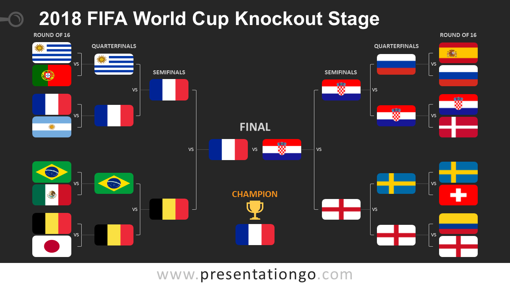

```{r setup, include=FALSE}
# some of common options (and the defaults) are: 
# include=T, eval=T, echo=T, results='hide'/'asis'/'markup',..., collapse=F, warning=T, message=T, error=T, cache=T, fig.width=6, fig.height=4, fig.dim=c(6,4) #inches, fig.align='left'/'center','right', 

pacman::p_load(ezids, ggplot2, ggsoccer, ggpubr, dplyr, vtable)
# knitr::opts_chunk$set(warning = F, results = "markup", message = F)
knitr::opts_chunk$set(warning = F, results = "markup", message = F, echo=F)
options(scientific=T, digits = 3) 
# options(scipen=9, digits = 3) 
# ‘scipen’: integer. A penalty to be applied when deciding to print numeric values in fixed or exponential notation.  Positive values bias towards fixed and negative towards scientific notation: fixed notation will be preferred unless it is more than ‘scipen’ digits wider.
# use scipen=999 to prevent scientific notation at all times
```

# Determining Which Variables Contribute to Shot Success in Soccer

```{r loading data}
#Load Event data from each competition as a dataframe
england<-data.frame(read.csv('./datasets/events_England_new.csv'))
england$competition <- "England"

italy<-data.frame(read.csv('./datasets/events_Italy_new.csv'))
italy$competition <- "Italy"

germany<-data.frame(read.csv('./datasets/events_Germany_new.csv'))
germany$competition <- "Germany"

france<-data.frame(read.csv('./datasets/events_France_new.csv'))
france$competition <- "France"

spain<-data.frame(read.csv('./datasets/events_Spain_new.csv'))
spain$competition <- "Spain"

european<-data.frame(read.csv('./datasets/events_European_Championship_new.csv'))
european$competition <- "European"

worldcup<-data.frame(read.csv('./datasets/events_World_Cup_new.csv'))
worldcup$competition <- "World Cup"
                     
#Append dataframes into a single dataframe from which to draw.
event_data<-rbind(england, italy, germany, france, spain, european, worldcup)

#convert x and y coordinate columns from characters to integer values
event_data$x.End <- as.numeric(event_data$x.End)
event_data$y.End <- as.numeric(event_data$y.End)

event_data$x.Start <- as.numeric(event_data$x.Start)
event_data$y.Start <- as.numeric(event_data$y.Start)

#convert event, subevent, tags, players, team labels, etc... to factors
event_data$Event.Name=as.factor(event_data$Event.Name)
event_data$Subevent.Name=as.factor(event_data$Subevent.Name)
event_data$Match.Period=as.factor(event_data$Match.Period)
event_data$Match.Date=as.factor(event_data$Match.Date)
event_data$Player=as.factor(event_data$Player)
event_data$Team.Name=as.factor(event_data$Team.Name)
event_data$Tag.1=as.factor(event_data$Tag.1)
event_data$Tag.2=as.factor(event_data$Tag.2)
event_data$Tag.3=as.factor(event_data$Tag.3)
event_data$Tag.4=as.factor(event_data$Tag.4)
event_data$Tag.5=as.factor(event_data$Tag.5)
event_data$Tag.6=as.factor(event_data$Tag.6)
```

## Chapter 1: Introduction
Soccer is the most watched sport in the world and is a business for teams worth hundreds of millions of dollars. In fact, 43% of the sports viewers in the World are interested in watching soccer, compared to 37% from Basketball viewers; and the FIFA World Cup Media rights income budgeted a whopping total of $3.0 billion USD for this event alone. (Nielson Sports, 2018) As a result, clubs put a great deal of time and resources towards achieving success. This includes collecting ever increasing amounts of data about their team’s performances and those of others. Unfortunately, most of these data sets are not publicly available. There are still small data sets that have become publicly available, such as this one obtained by Luca Pappalardo on Figshare. From this small data set we hope to gain some insight into the game and an understanding of how data is coming to be used in soccer. 

## Chapter 2: Data Set Overview
### 2.1 Data Source
The dataset contains all matches played in Europe’s top five leagues during the 2017/2018 season (380 matches per league for a total of 1900 matches, producing 643,149 match events), the 2016 European Championship (51 matches, producing 78,139 match events), and the 2018 World Cup (64 matches, 101,758 match events). The data was imported by league and then compiled into a single data frame, giving a total of 3,251,294 events and 19 variables. This data was originally released by Wyscout.
```{r}
str(event_data)
```
### 2.2 Calculating and Adding Event Distance Variable
One variable we are interested in looking at is the distance of assists and key passes and whether this plays a role in the success of the pass and whether it results in a successful shot on goal or not. We have to calculate distance for each event using the x,y-coordinates given in the data set. To do this we assumed field dimensions of 120 yards in length of 75 yards wide. This is the average size of a soccer pitch. We then are able to calculate event distances in yards instead of percentages. If the x and y coordinates in percentage were used we'd get a distorted distance since in reality a soccer field is not square. In this report x & y-coordinates are displayed as percentages, while event distance is displayed in yards so results are not distorted.
```{r calculate distance}

event_data<-event_data %>% mutate(dist = sqrt(((x.End-x.Start)*1.20)^2+((y.End-y.Start)*0.75)^2))

event_data$dist <- as.numeric(event_data$dist)
```

### 2.3 Subsetting Data
With so many variables available we had to start by narrowing the number to look at. Since we’re interested in what variables affect the success rate of a shot on goal, we wanted to look into the variables immediately preceding a goal. Upon consulting with a subject matter expert on our team, we've identified those variables to be shots, assists, and key passes, and the x,y-coordinates and event distance for each. It is worth noting that in our classroom presentation, we reported some analyses surrounding shot distance. Upon further inspection of the data, we found that the coordinates of the end points of goals and shots did not reflect what we expect to see in reality (in particular, the y coordinates of successful shots were not matching the location of the goal). Because of this, the team decided to omit the analysis on distance and focus on the x and y coordinates of the starting point. Separate data frames were created for each of the following events of interest: 

1.	Key passes: pass leading to unsuccessful scoring opportunity 
2.	Assists: pass leading to a goal   
3.	Shots: unsuccessful shots on goal  
4.	Goals: successful shots on goal   

```{r event datasets}
#Collect shots, goals, assists, and key passes into their own dataframes
shots<-subset(event_data, Event.Name=='Shot')
shots<-subset(shots, Tag.1!='Goal')
goals<-subset(event_data, Tag.1=='Goal')
goals<-subset(goals, Event.Name!='Save attempt')
assists<-subset(event_data, Tag.1=='Assist')
key_passes<-subset(event_data, Tag.1=='Key pass')
```

## Chapter 3: Exploratory Data Analysis
### 3.1 Understanding the Field
To understand our data, we needed to first understand how the field is set up. The field is set up so that the length is given by the x-coordinate, and the width is given by the y-coordinate. Each coordinate is given as a percentage. Events are always oriented so that the attacking team is going from left to right.

<center>

{height=66%, width=66%}

<center>

**Figure 1.** Pitch schematic showing direction of attack and event x,y-coordinate example.

### 3.2 Event Visualization
#### 3.2.1 Visualizing Field Locations
Using the ggsoccer library to plot event data on an image of a pitch and bordering the x and y axis with event density plots we were quickly able to understand how each event is distributed on the pitch, shown in Figure 2. Several observations can be made from this visualization. First, the x & y-coordinates for both key passes and assists are multimodal and appear to be symmetric across the y=50 line. This makes sense as teams try to attack down both sides of the field. With this data being an average over so many games getting a symmetric split between the two sides of the field is expected. This symmetry could be a factor that varies from team to team, however. Second, the x & y-coordinate distributions for shots and goals is much closer to normal. The exception being the x-coordinate for shots which is bimodal. This is interesting because it indicates that a significant portion of shots are taken farther away from goal, however, very few goals are scored from these shots. Despite this, players still seem to take these shots. 
  
```{r plot events on soccer pitch}
shots_fig<-ggplot(shots)+
  annotate_pitch()+
  geom_point(aes(x=x.Start, y=y.Start))+
  #scale_color_continuous(color='reds')+
  #geom_point(aes(x=x.Start, y=y.Start))+
  theme_pitch()+
  theme(plot.margin = unit(c(-0.5,-0.5,-0.5,-0.5), 'cm'))

goals_fig<-ggplot(goals)+
  annotate_pitch()+
  geom_point(aes(x=x.Start, y=y.Start))+
  theme_pitch()+
  theme(plot.margin = unit(c(-0.5,-0.5,-0.5,-0.5), 'cm'))

key_passes_fig<-ggplot(key_passes)+
  annotate_pitch()+
  geom_point(aes(x=x.Start, y=y.Start))+
  theme_pitch()+
  theme(plot.margin = unit(c(-0.5,-0.5,-0.5,-0.5), 'cm'))

assists_fig<-ggplot(assists)+
  annotate_pitch()+
  geom_point(aes(x=x.Start, y=y.Start))+
  theme_pitch()+
  theme(plot.margin = unit(c(-0.5,-0.5,-0.5,-0.5), 'cm'))
```

```{r density plots for pitch event plots}
key_passes_histx<-ggplot()+
  geom_density(data=(key_passes), aes(x=x.Start, y=..density..), color='Black', fill='Gold', alpha=0.3)+
  scale_x_continuous(limits = c(0,100))+
  theme(panel.background=element_blank(),
        panel.grid.major = element_blank(),
        panel.grid.minor = element_blank(),
        axis.title = element_blank(),
        axis.text = element_blank(),
        axis.ticks = element_blank(),
        plot.margin = unit(c(0,0,-0.5,-0.1), 'cm'))

key_passes_histy<-ggplot()+
  geom_density(data=(key_passes), aes(x=y.Start, y=..density..), color='Black', fill='Gold', alpha=0.3)+
  scale_x_continuous(limits = c(0,100))+
  theme(panel.background=element_blank(),
        panel.grid.major = element_blank(),
        panel.grid.minor = element_blank(),
        axis.title = element_blank(),
        axis.text = element_blank(),
        axis.ticks = element_blank(),
        plot.margin = unit(c(0,0,0.1,-0.5), 'cm'))+
  rotate()

assists_histx<-ggplot()+
  geom_density(data=(assists), aes(x=x.Start, y=..density..), color='Black', fill='Green', alpha=0.3)+
  scale_x_continuous(limits = c(0,100))+
  theme(panel.background=element_blank(),
        panel.grid.major = element_blank(),
        panel.grid.minor = element_blank(),
        axis.title = element_blank(),
        axis.text = element_blank(),
        axis.ticks = element_blank(),
        plot.margin = unit(c(0,0,-0.5,-0.1), 'cm'))

assists_histy<-ggplot()+
  geom_density(data=(assists), aes(x=y.Start, y=..density..), color='Black', fill='Green', alpha=0.3)+
  scale_x_continuous(limits = c(0,100))+
  theme(panel.background=element_blank(),
        panel.grid.major = element_blank(),
        panel.grid.minor = element_blank(),
        axis.title = element_blank(),
        axis.text = element_blank(),
        axis.ticks = element_blank(),
        plot.margin = unit(c(0,0,0.1,-0.5), 'cm'))+
  rotate()

shots_histx<-ggplot()+
  geom_density(data=(shots), aes(x=x.Start, y=..density..), color='Black', fill='Red', alpha=0.3)+
  scale_x_continuous(limits = c(0,100))+
  theme(panel.background=element_blank(),
        panel.grid.major = element_blank(),
        panel.grid.minor = element_blank(),
        axis.title = element_blank(),
        axis.text = element_blank(),
        axis.ticks = element_blank(),
        plot.margin = unit(c(0,0,-0.5,-0.1), 'cm'))


shots_histy<-ggplot()+
  geom_density(data=(shots), aes(x=y.Start, y=..density..), color='Black', fill='Red', alpha=0.3, ylim=c(0,100))+
  scale_x_continuous(limits = c(0,100))+
  theme(panel.background=element_blank(),
        panel.grid.major = element_blank(),
        panel.grid.minor = element_blank(),
        axis.title = element_blank(),
        axis.text = element_blank(),
        axis.ticks = element_blank(),
        plot.margin = unit(c(0,0,0.1,-0.5), 'cm'))+
  rotate()

goals_histx<-ggplot()+
  geom_density(data=(goals), aes(x=x.Start, y=..density..), color='Black', fill='Blue', alpha=0.3)+
  scale_x_continuous(limits = c(0,100))+
  theme(panel.background=element_blank(),
        panel.grid.major = element_blank(),
        panel.grid.minor = element_blank(),
        axis.title = element_blank(),
        axis.text = element_blank(),
        axis.ticks = element_blank(),
        plot.margin = unit(c(0,0,-0.5,-0.1), 'cm'))

goals_histy<-ggplot()+
  geom_density(data=(goals), aes(x=y.Start, y=..density..), color='Black', fill='Blue', alpha=0.3, ylim=c(0,100))+
  scale_x_continuous(limits = c(0,100))+
  theme(panel.background=element_blank(),
        panel.grid.major = element_blank(),
        panel.grid.minor = element_blank(),
        axis.title = element_blank(),
        axis.text = element_blank(),
        axis.ticks = element_blank(),
        plot.margin = unit(c(0,0,0.1,-0.5), 'cm'))+
  rotate()
```

```{r pitch+hist plots, fig.show='hold', out.width='50%'}
key_pass_dist_pitch<-ggarrange(key_passes_histx, NULL, key_passes_fig, key_passes_histy,
          ncol=2, nrow=2,
          widths=c(2,1), heights=c(1,2)) %>%
  annotate_figure(top=text_grob('Key Pass Distribution', face='bold', size=20))

assist_dist_pitch<-ggarrange(assists_histx, NULL, assists_fig, assists_histy,
          ncol=2, nrow=2,
          widths=c(2,1), heights=c(1,2)) %>%
  annotate_figure(top=text_grob('Assist Distribution', face='bold', size=20))

shot_dist_pitch<-ggarrange(shots_histx, NULL, shots_fig, shots_histy,
          ncol=2, nrow=2,
          widths=c(2,1), heights=c(1,2)) %>%
  annotate_figure(top=text_grob('Shot Distribution', face='bold', size=20))

goal_dist_pitch<-ggarrange(goals_histx, NULL, goals_fig, goals_histy,
          ncol=2, nrow=2,
          widths=c(2,1), heights=c(1,2)) %>%
  annotate_figure(top=text_grob('Goal Distribution', face='bold', size=20))

key_pass_dist_pitch
assist_dist_pitch
shot_dist_pitch
goal_dist_pitch
```
**Figure 2.** Event field locations and x & y-coordinate density plots for (Top Left) Key Passes, (Top Right) Assists, (Bottom Left) Shots, and (Bottom Right) Goals.

#### 3.2.2 Event Distance Distributions
The distance distributions for key passes and assists are displayed in Figure 3. Both show fairly normal distributions, despite the fact that neither the x,y-coordinates for these two events show normal distributions. The distances of shots and goals were not examined as the x & y end coordinates given in the dataset were found to be inaccurate.

```{r event distance distribution, fig.show='hold', out.width='50%'}
key_pass_dist<-ggplot()+
  geom_density(data=key_passes, aes(x=dist, y=..density..), color='Black', fill='Gold', alpha=0.3)+
  xlim(c(0,150))+
  labs(title="Key Pass Distances", x="Distance", y="", )+
  theme(panel.background = element_blank(),
        panel.border=element_rect(color='black', fill=NA),
        axis.text.x = element_text(size=16),
        axis.text.y = element_blank(),
        axis.ticks.y = element_blank(),
        axis.title = element_text(size=16),
        plot.title = element_text(size=20, hjust = 0.5))

assist_dist<-ggplot()+
  geom_density(data=assists, aes(x=dist, y=..density..), color='Black', fill='Green', alpha=0.3)+
  xlim(c(0,150))+
  labs(title="Assist Distances", x="Distance", y="")+
  theme(panel.background = element_blank(),
        panel.border=element_rect(color='black', fill=NA),
        axis.text.x = element_text(size=16),
        axis.text.y = element_blank(),
        axis.ticks.y = element_blank(),
        axis.title = element_text(size=16),
        plot.title = element_text(size=20, hjust = 0.5))

shot_dist<-ggplot()+
  geom_density(data=shots, aes(x=dist, y=..density..), color='Black', fill='Red', alpha=0.3)+
  xlim(c(0,150))+
  labs(title="Shot Distances", x="Distance (yards)", y="")+
  theme(panel.background = element_blank(),
        panel.border=element_rect(color='black', fill=NA),
        axis.text.x = element_text(size=16),
        axis.text.y = element_blank(),
        axis.ticks.y = element_blank(),
        axis.title = element_text(size=16),
        plot.title = element_text(size=20, hjust = 0.5))

goal_dist<-ggplot()+
  geom_density(data=goals, aes(x=dist, y=..density..), color='Black', fill='Blue', alpha=0.3)+
  xlim(c(0,150))+
  labs(title="Goal Distances", x="Distance (yards)", y="")+
  scale_color_manual(name='Key',values=c('Green', 'Red'), labels=c('Assists','Key Passes'))+
  theme(panel.background = element_blank(),
        panel.border=element_rect(color='black', fill=NA),
        axis.text.x = element_text(size=16),
        axis.text.y = element_blank(),
        axis.ticks.y = element_blank(),
        axis.title = element_text(size=16),
        plot.title = element_text(size=20, hjust = 0.5))

key_pass_dist
assist_dist
```
**Figure 3.** Event distance for (Left)  Key Passes and (Right) Assists.

### 3.3 Differences in Event Distributions
From looking at Figures 2 and 3, we already see several points that are outliers. For example, when looking at the figure showing shot events several shots can be seen to occur in the defensive half of the field. When looking at the bordering density plot, we see that these events, while they do occur, are rare compared with the majority of shots taken. From this we felt safe cleaning our events to remove these sorts of outliers before taking a deep dive into the distributions.  

```{r checking for outliers, include=FALSE}
#Set to TRUE of all plots for each varialbe want to be seen.
show_all_plots=FALSE

assists_clean<-outlierKD2(assists, dist, rm=TRUE, boxplt = FALSE, histogram = FALSE, qqplt = FALSE)
assists_clean<-na.omit(assists_clean)

assists_clean_x<-outlierKD2(assists, x.Start, rm=TRUE, 
                            boxplt = show_all_plots, 
                            histogram = show_all_plots, 
                            qqplt = show_all_plots)
assists_clean_x<-na.omit(assists_clean_x)

assists_clean_y<-outlierKD2(assists, y.Start, rm=TRUE, 
                            boxplt = show_all_plots, 
                            histogram = show_all_plots, 
                            qqplt = show_all_plots)
assists_clean_y<-na.omit(assists_clean_y)

key_passes_clean<-outlierKD2(key_passes, dist, rm=TRUE,  
                            boxplt = show_all_plots, 
                            histogram = show_all_plots, 
                            qqplt = show_all_plots)
key_passes_clean<-na.omit(key_passes_clean)

key_passes_clean_x<-outlierKD2(key_passes, x.Start, rm=TRUE,  
                            boxplt = show_all_plots, 
                            histogram = show_all_plots, 
                            qqplt = show_all_plots)
key_passes_clean_x<-na.omit(key_passes_clean_x)

key_passes_clean_y<-outlierKD2(key_passes, y.Start, rm=TRUE,  
                            boxplt = show_all_plots, 
                            histogram = show_all_plots, 
                            qqplt = show_all_plots)
key_passes_clean_y<-na.omit(key_passes_clean_y)

shots_clean<-outlierKD2(shots, dist, rm=TRUE,  
                            boxplt = show_all_plots, 
                            histogram = show_all_plots, 
                            qqplt = show_all_plots)
shots_clean<-na.omit(shots_clean)

shots_clean_x<-outlierKD2(shots, x.Start, rm=TRUE,  
                            boxplt = show_all_plots, 
                            histogram = show_all_plots, 
                            qqplt = show_all_plots)
shots_clean_x<-na.omit(shots_clean_x)

shots_clean_y<-outlierKD2(shots, y.Start, rm=TRUE,  
                            boxplt = show_all_plots, 
                            histogram = show_all_plots, 
                            qqplt = show_all_plots)
shots_clean_y<-na.omit(shots_clean_y)

goals_clean<-outlierKD2(goals, dist, rm=TRUE,  
                            boxplt = show_all_plots, 
                            histogram = show_all_plots, 
                            qqplt = show_all_plots)
goals_clean<-na.omit(goals_clean)

goals_clean_x<-outlierKD2(goals, x.Start, rm=TRUE,  
                            boxplt = show_all_plots, 
                            histogram = show_all_plots, 
                            qqplt = show_all_plots)
goals_clean_x<-na.omit(goals_clean_x)

goals_clean_y<-outlierKD2(goals, y.Start, rm=TRUE,  
                            boxplt = show_all_plots, 
                            histogram = show_all_plots, 
                            qqplt = show_all_plots)
goals_clean_y<-na.omit(goals_clean_y)

```
#### 3.3.1 Fitting Event Distributions
After cleaning the data we plotted histograms for each variable, comparing key passes with assists and shots with goals by plotting them on the same plots. We then attempted to fit each distribution with a normal distribution. As seen in Figures 4 and 5, not all variables are well fitted by a normal distribution, such as the x & y-coordinate distribution of key passes and assists, and the x-coordinate shot distribution. The rest appear to be reasonably well fit with a normal distribution.  
```{r Comparing variable distributions, fig.show='hold', out.width='33%'}

#Histograms of Assist and Key Pass x Coordinates
ak_hist_x<-ggplot()+
  geom_histogram(data=(assists_clean_x), aes(x=x.Start, y=..density..), color='Black', fill='Green', alpha=0.3)+
  
  geom_histogram(data=(key_passes_clean_x), aes(x=x.Start, y=..density..), color='Black', fill='Gold', alpha=0.3)+
  
  stat_function(fun = dnorm, args = list(mean = mean(assists_clean_x$x.Start), sd = sd(assists_clean_x$x.Start)), color='dark green', fill='green', size=1)+
  
  stat_function(fun = dnorm, args = list(mean = mean(key_passes_clean_x$x.Start), sd = sd(key_passes_clean_x$x.Start)), color='Gold', fill='Gold', size=1)+
  
  labs(title="x-coordinates of Key Passes & Assists", x="x-coordinate", y="Normalized Count")+
  
  scale_color_manual(name='Key',values=c('Green', 'Red'), labels=c('Assists','Key Passes'))+
  theme(panel.background = element_blank(),
        panel.border=element_rect(color='black', fill=NA),
        axis.text = element_text(size=20),
        axis.title = element_text(size=20),
        plot.title = element_text(size=24, hjust=0.5))

#Histograms of Assist and Key Pass y Coordinates
ak_hist_y<-ggplot()+
  geom_histogram(data=(assists_clean_y), aes(x=y.Start, y=..density..), color='Black', fill='Green', alpha=0.3)+
  
  geom_histogram(data=(key_passes_clean_y), aes(x=y.Start, y=..density..), color='Black', fill='Gold', alpha=0.3)+
  
  stat_function(fun = dnorm, args = list(mean = mean(assists_clean_y$y.Start), sd = sd(assists_clean_y$y.Start)), color='dark green', fill='green', size=1)+
  
  stat_function(fun = dnorm, args = list(mean = mean(key_passes_clean_y$y.Start), sd = sd(key_passes_clean_y$y.Start)), color='gold', fill='gold', size=1)+
  
  labs(title="y-coordinates of Key Passes & Assists", x="y-coordinate", y="Normalized Count")+
  
  scale_color_manual(name='Key',values=c('Green', 'Red'), labels=c('Assists','Key Passes'))+
  theme(panel.background = element_blank(),
        panel.border=element_rect(color='black', fill=NA),
        axis.text = element_text(size=20),
        axis.title = element_text(size=20),
        plot.title = element_text(size=24, hjust=0.5))

#Histograms of Assist and Key Pass Distance
ak_hist_d<-ggplot()+
  geom_histogram(data=assists_clean, aes(x=dist, y=..density..), color='Black', fill='Green', alpha=0.3)+
  
  geom_histogram(data=key_passes_clean, aes(x=dist, y=..density..), color='Black', fill='Gold', alpha=0.3)+
  
  stat_function(fun = dnorm, args = list(mean = mean(assists_clean$dist), sd = sd(assists_clean$dist)), color='dark green', fill='green', size=1)+
  
  stat_function(fun = dnorm, args = list(mean = mean(key_passes_clean$dist), sd = sd(key_passes_clean$dist)), color='Gold', fill='gold', size=1)+
  
  labs(title="Distance of Assists and Key Passes", x="Distance (yards)", y="Normalized Count")+
  
  scale_color_manual(name='Key',values=c('Green', 'Red'), labels=c('Assists','Key Passes'))+
  theme(panel.background = element_blank(),
        panel.border=element_rect(color='black', fill=NA),
        axis.text = element_text(size=20),
        axis.title = element_text(size=20),
        plot.title = element_text(size=24, hjust=0.5))

ak_hist_x
ak_hist_y
ak_hist_d
```
**Figure 4.** Key pass (yellow) and assist (green) histograms for (Left) x-coordinate, (Middle) y-coordinate, (Right) distance with normal distribution fits.  

```{r comparing shots and goals distributions, fig.show='hold', out.width='50%'}
sg_hist_x<-ggplot()+
  geom_histogram(data=(shots_clean_x), aes(x=x.Start, y=..density..), color='Black', fill='Red', alpha=0.3)+
  
  geom_histogram(data=(goals_clean_x), aes(x=x.Start, y=..density..), color='Black', fill='Blue', alpha=0.3)+
  
  stat_function(fun = dnorm, args = list(mean = mean(shots_clean_x$x.Start), sd = sd(shots_clean_x$x.Start)), color='dark red', fill='red', size=1)+
  
  stat_function(fun = dnorm, args = list(mean = mean(goals_clean_x$x.Start), sd = sd(goals_clean_x$x.Start)), color='dark blue', fill='blue', size=1)+
  
  labs(title="X-coordinates of Shots & Goals", x="x-coordinate", y="Normalized Count")+
  
  scale_color_manual(name='Key',values=c('Blue', 'Red'), labels=c('Goals','Shots'))+
  theme(panel.background = element_blank(),
        panel.border=element_rect(color='black', fill=NA),
        axis.text = element_text(size=14),
        axis.title = element_text(size=14),
        plot.title = element_text(size=18, hjust=0.5))

sg_hist_y<-ggplot()+
  geom_histogram(data=shots_clean_y, aes(x=y.Start, y=..density..), color='Black', fill='Red', alpha=0.3)+
  
  geom_histogram(data=goals_clean_y, aes(x=y.Start, y=..density..), color='Black', fill='Blue', alpha=0.3)+
  
  stat_function(fun = dnorm, args = list(mean = mean(shots_clean_y$y.Start), sd = sd(shots_clean_y$y.Start)), color='dark red', fill='red', size=1)+
  
  stat_function(fun = dnorm, args = list(mean = mean(goals_clean_y$y.Start), sd = sd(goals_clean_y$y.Start)), color='dark blue', fill='blue', size=1)+
  
  labs(title="Y-coordinates of Shots & Goals", x="y-coordinate", y="Normalized Count")+
  
  scale_color_manual(name='Key',values=c('Blue', 'Red'), labels=c('Goals','Shots'))+
  theme(panel.background = element_blank(),
        panel.border=element_rect(color='black', fill=NA),
        axis.text = element_text(size=14),
        axis.title = element_text(size=14),
        plot.title = element_text(size=18, hjust=0.5))

sg_hist_x
sg_hist_y
```
**Figure 5.** Shots (red) and Goals (blue) histograms for (Left) x-coordinate, (Middle) y-coordinate, (Right) distance with normal distribution fits.

#### 3.3.2 T-tests: Comparing Assists vs Key Passes and Shots vs Goals
T-tests were performed to check for differences between x & y coordinates between key passes and assists and between shots and goals. The pass distance between key passes and assists was also checked for differences using the t-test. With population sizes for each of our events on the order of several thousand for assists and goals to greater than ten thousand for key passes and shots, t-tests can still be applied to determine differences in the sample means, thanks to the central limit theorem which states that the distribution of sample means of a population still show a normal distribution, with large enough sample size, even if the population shows a non-normal distribution.
```{r hypothesis testing}

#Distance
ttest_assist_v_keypass_dist <- t.test(assists_clean$dist, mu=mean(key_passes_clean$dist), conf.level=0.95)

#Starting X-coordinate
ttest_assist_v_keypass_x <- t.test(assists_clean_x$x.Start, mu=mean(key_passes_clean$x.Start), conf.level=0.95)
ttest_goals_v_shots_x <- t.test(goals_clean_x$x.Start, mu=mean(shots_clean$x.Start), conf.level = 0.95)

#Starting Y-coordinate
ttest_assist_v_keypass_y <- t.test(assists_clean_y$y.Start, mu=mean(key_passes_clean$y.Start), conf.level=0.95)
ttest_goals_v_shots_y <- t.test(goals_clean_y$y.Start, mu=mean(shots_clean$y.Start), conf.level = 0.95)
```
##### Assists vs Key Passes:
T-tests with a 95% confidence level were run on the assist and key pass variables: x-coordinate, y-coordinate, and distance. For each of these variables the null hypothesis was set as no difference between the variable means for assists and key passes.

Below is the result for the x-coordinate. The resulting p-value is on the order of 1e-07 signifying a statistically significant difference in the x-coordinate between assists and key passes. This result shows that, on average, final passes made further up the field are more likely to result in an assist than a key pass.
```{r ttest results assists vs key passes x}
ttest_assist_v_keypass_x
```
When looking at the y-coordinate a p-value of 0.5 is obtained which would indicate no difference between assists and key pass. Since these distributions are not actually normal and symmetric around the y=50 line, when we assume a normal distribution we get an inaccurate result.
```{r ttest results assists vs key passes y}
ttest_assist_v_keypass_y
```
The last variable to be looked at was the distance variable. The t-test here resulted in a p-value < 2e-16. This indicates that there is a significant difference between the distance covered by an assist vs a key pass, with assists having an average distance of 24.3 yards with a confidence interval from 23.9 - 224.7, and key passes having a mean distance of 27.5 yards. This shows that final passes that have to cover a shorter distance are more likely to result in an assist.
```{r ttest results assists vs key passes dist}
ttest_assist_v_keypass_dist
```
##### Goals vs Shots:
Next, t-tests with a 95% confidence level were run on the goals and shots variables: x & y-coordinates. For these variables the null hypothesis was again set as no difference between the variable means for assists and key passes.

Below is the result for the x-coordinate. The resulting p-value is < 2e-16, meaning there is a statistically significant difference between goals and shots. With the shot x-coordinate mean equal to 84.1 and lying outside the confidence interval for goals, 90.7 - 90.9, we can conclude that attempts on goal taken further up the field are more likely to result in a goal.
```{r shots vs goals x}
ttest_goals_v_shots_x
```
Looking now at the results for the y-coordinate, a p-value of 0.005 is obtained, still indicating a statistically significant difference of this variable between goals and shots. The shot mean y-coordinate is 49.2 and sits just outside the confidence interval of 49.3 - 49.8 for the goals y-coordinate. This is an interesting result as we expected for there not to be a difference in the y-coordinate. This is because shots are taken from both sides of the field in about equal measure, yet it seems that perhaps the shot distribution favors the right side more than the left, but more goals are scored from a more central location. It could be that while this result is statistically significant, in reality though it probably isn't. For example, an average professional soccer pitch is about 70 meters wide. So, a difference of 0.1% in the y-coordinate is a difference of 0.07 meters, which is not really a significant difference. Results like this warrant further investigation and perhaps a more refined modeling approach that has fewer assumptions about distributions than the t-test.
```{r shots vs goals y}
ttest_goals_v_shots_y
```

## Chapter 4: SMART Questions

### SMART Question 1: Among the variables Key Pass, Shot, Assist, and Goal within the data from the 2016 European Championship, the 2017/2018 Europe’s top five leagues, and the 2018 World Cup, which configuration of the variables result in a higher probability of a goal being scored? 
The t-tests done in the previous section demonstrate that there are differences in our selected variables between key passes and assists and between shots and goals. However, this only points us to variables that matter (in that there is a difference in coordinates or distance between a successful and an unsuccessful event), and it does not fully answer the question: which variables result in the highest probability on goal? In other words, in a match, what field positions should teams target to improve the likelihood of scoring a goal? To answer this, we calculated and plotted the success probabilities of the final pass (successful = assist = goal) and shots (successful = goal) as a function of their starting x-coordinate, y-coordinate and in the case of the final pass, the pass distance. The results are shown below in Figure 6.  
```{r Success probability plots, fig.show='hold', out.width='33%'}
#Assist:key pass ratio x-coordinate
assist_density_x<-density(assists_clean_x$x.Start,
                          n=100, from = 0, to = 100)
key_pass_density_x<-density(key_passes_clean_x$x.Start,
                            n=100, from = 0, to = 100)

assist_density_x$y=assist_density_x$n/sum(assist_density_x$y)*assist_density_x$y
key_pass_density_x$y=key_pass_density_x$n/sum(key_pass_density_x$y)*key_pass_density_x$y
total_keyassists_x=assist_density_x$y+key_pass_density_x$y
assist_prob_x=assist_density_x$y/total_keyassists_x

plot(assist_prob_x, 
     xlim=c(50, 100), ylim=c(0,1),
     xlab='Field Length Percentage',
     ylab='Goal Probability',
     main = 'Goal Probability: Final Pass x-coordinate',
     cex.lab=1.5,
     cex.axis=1.5,
     cex.main=1.75,
     pch=19)

#Assist:key pass ratio y-coordinate
assist_density_y<-density(assists_clean_y$y.Start,
                          n=100, from = 0, to = 100)
key_pass_density_y<-density(key_passes_clean_y$y.Start,
                            n=100, from = 0, to = 100)

assist_density_y$y=assist_density_y$n/sum(assist_density_y$y)*assist_density_y$y
key_pass_density_y$y=key_pass_density_y$n/sum(key_pass_density_y$y)*key_pass_density_y$y
total_keyassists_y=assist_density_y$y+key_pass_density_y$y
assist_prob_y=assist_density_y$y/total_keyassists_y

plot(assist_prob_y, ylim=c(0,1),
     xlab='Field Width Percentage',
     ylab='Goal Probability',
     main = 'Goal Probability: Final Pass y-coordinate',
     cex.lab=1.5,
     cex.axis=1.5,
     cex.main=1.75,
     pch=19)

#Assist:Key pass ratio distance
assist_density_length<-density(assists_clean$dist,
                               n=100, from = 0, to = 100)
key_pass_density_length<-density(key_passes_clean$dist,
                                 n=100, from = 0, to = 100)

assist_density_length$y=assist_density_length$n/sum(assist_density_length$y)*assist_density_length$y
key_pass_density_length$y=key_pass_density_length$n/sum(key_pass_density_length$y)*key_pass_density_length$y
total_keyassists=assist_density_length$y+key_pass_density_length$y
assist_prob_length=assist_density_length$y/total_keyassists

plot(assist_prob_length, ylim=c(0,1),
     xlab='Pass Distance (yards)',
     ylab='Goal Probability',
     main = 'Goal Probability: Final Pass Distance',
     cex.lab=1.5,
     cex.axis=1.5,
     cex.main=1.75,
     pch=19)

#Goal percentage x-coordinate
goal_density_x<-density(goals_clean_x$x.Start,
                        n=100, from=0, to=100)

shots_density_x<-density(shots_clean_x$x.Start,
                         n=100, from=0, to=100)

goal_density_x$y=goal_density_x$n/sum(goal_density_x$y)*goal_density_x$y
shots_density_x$y<-shots_density_x$n/sum(shots_density_x$y)*shots_density_x$y
total_shots_x<-goal_density_x$y+shots_density_x$y
goal_shot_prob_x<-(goal_density_x$y/total_shots_x)

plot(goal_shot_prob_x, 
     xlim=c(60, 100), ylim=c(0,1),
     xlab='Field Length Percentage',
     ylab='Goal Probability',
     main = 'Goal Probability: Shot x-coordinate',
     cex.lab=1.5,
     cex.axis=1.5,
     cex.main=1.75,
     pch=19)

#Goal percentage y-coordinate
goal_density_y<-density(goals_clean$y.Start,
                        n=100, from=5, to=95)
shots_density_y<-density(shots_clean_y$y.Start,
                         n=100, from=5, to=95)

goal_density_y$y=goal_density_y$n/sum(goal_density_y$y)*goal_density_y$y
shots_density_y$y=shots_density_y$n/sum(shots_density_y$y)*shots_density_y$y
total_shots_y<-goal_density_y$y+shots_density_y$y
goal_shot_prob_y<-(goal_density_y$y/total_shots_y)


plot(goal_shot_prob_y, 
     xlim=c(0, 100), ylim=c(0,1),
     xlab='Field Width Percentage',
     ylab='Goal Probability',
     main = 'Goal Probability: Shot y-coordinate',
     cex.lab=1.5,
     cex.axis=1.5,
     cex.main=1.75,
     pch=19)
```
  
**Figure 6.** Goal probability plots for (Top Left) final pass x-coordinate, (Top Middle) final pass y-coordinate, (Top Right) final pass distance, (Bottom Left) shot x-coordinate, and (Bottom Right) shot y-coordinate.  
  
From these plots we can make some conclusions about each variables role in determining a successful shot on goal. First, goal probability varies with respect to all selected variables. The one exception to this is the final pass x-coordinate which remains relatively constant. Second, goal probability shows the greatest change as functions of final pass distance and shot x-coordinate. In the case of final pass distance, the probability of a goal approaches 0.4 as the length of the pass decreases. In the case of shot x-coordinate, the goal probability also approaches 0.4 as the x-coordinate approaches 100, gets closer to the goal. The goal probability of the final pass and shot y-coordinates also shows peaks, in these two cases the peak is symmetric around the y=50 line. However, the difference between goal probability at the peak and at the baseline is slightly lower, about 0.25, compared with the final pass distance and shot x-coordinate variables. 

### SMART Question 2: How do these variables and configurations vary across different teams?
Based on the t-test results, we now know that there is some evidence that there are differences between means of x & y coordinates and distance of key passes vs assists, and separately, x & y coordinates of shots and goals. An interesting follow-up question is whether or not teams build strategies around these variables and if so, do these strategies differ across teams? We can use boxplots to visualize and ANOVA to test for any differences.

For now, our team demonstrates this extension of our analyses using World Cup data for 5 teams with the highest frequency of shots + goals and assists + key passes. These 5 teams are Belgium, England, Croatia, Brazil, and France. This makes sense as, with the exception of Brazil, these teams were all semifinalists. Brazil at least makes it to the quarterfinals of the 2018 World Cup.

  

For each of these teams, we plot the x and y coordinates and distance of their final passes (not distinguishing between assists and key passes because strategy is made prior to the end result of a goal or non-goal). We also plot the x and y coordinates of their shots (once again, not distinguishing between goals and non-goals). See Figure 7 below.

```{r worldcup teams, fig.show='hold', out.width='33%'}
# Stack assist and key pass dataset
assist_key_pass <-rbind(assists_clean, key_passes_clean)
assist_key_pass_wc <- subset(assist_key_pass, competition=="World Cup")

# Focus on top 5 teams with most assists + key passes
freq1 <- sort(table(assist_key_pass_wc$Team.Name),decreasing=T)

assist_key_pass_wc$Team.Name <- as.character(assist_key_pass_wc$Team.Name)

assist_key_pass_wc_top5 <- subset(assist_key_pass_wc, Team.Name == "Belgium" | Team.Name == "England" | Team.Name == "Croatia" | Team.Name == "Brazil" | Team.Name == "France")

ak_box_x_wc<-boxplot(assist_key_pass_wc_top5$x.Start ~ assist_key_pass_wc_top5$Team.Name,
                     main = "Assist or Key Pass x-coordinate", 
                     ylab = "x-coordinate", 
                     xlab = "Team", 
                     col=c("red","orange","yellow","green","blue"), 
                     cex.lab=1.5,
                     cex.axis=1.25,
                     cex.main=1.75,
                     ylim=c(0,100))

ak_box_x_wc<-boxplot(assist_key_pass_wc_top5$y.Start ~ assist_key_pass_wc_top5$Team.Name, 
                     main = "Assist or Key Pass y-coordinate", 
                     ylab = "y-coordinate", 
                     xlab = "Team", 
                     col=c("red","orange","yellow","green","blue"),
                     cex.lab=1.5,
                     cex.axis=1.25,
                     cex.main=1.75,
                     ylim=c(0,100))

ak_box_dist_wc<-boxplot(assist_key_pass_wc_top5$dist ~ assist_key_pass_wc_top5$Team.Name, 
                        main = "Assist or Key Pass Distance", 
                        ylab = "Distance (yards)", 
                        xlab = "Team", 
                        col=c("red","orange","yellow","green","blue"),
                        cex.lab=1.5,
                        cex.axis=1.25,
                        cex.main=1.75,
                        ylim=c(0,100))

# Stack shot and goal dataset
shots_goals <-rbind(shots_clean, goals_clean)
shots_goals_wc <- subset(shots_goals, competition=="World Cup")

# Focus on top 5 teams with most goals + shots
freq2 <- sort(table(shots_goals_wc$Team.Name),decreasing=T)

shots_goals_wc$Team.Name <- as.character(shots_goals_wc$Team.Name)

shots_goals_wc_top5 <- subset(shots_goals_wc, Team.Name == "Belgium" | Team.Name == "England" | Team.Name == "Croatia" | Team.Name == "Brazil" | Team.Name == "France")

sg_box_x_wc<-boxplot(shots_goals_wc_top5$x.Start ~ shots_goals_wc_top5$Team.Name, 
                     main = "Shot or Goal x-coordinate", 
                     ylab = "x-coordinate", 
                     xlab = "Team", 
                     col=c("red","orange","yellow","green","blue"),
                     cex.lab=1.5,
                     cex.axis=1.25,
                     cex.main=1.75,
                     ylim=c(50,100))

sg_box_y_wc<-boxplot(shots_goals_wc_top5$y.Start ~ shots_goals_wc_top5$Team.Name, 
                     main = "Shot or Goal y-coordinate", 
                     ylab = "y-coordinate", 
                     xlab = "Team", 
                     col=c("red","orange","yellow","green","blue"),
                     cex.lab=1.5,
                     cex.axis=1.25,
                     cex.main=1.75,
                     ylim=c(0,100))  
```

**Figure 7.** Boxplots of (Top Left) final pass x-coordinate, (Top Middle) final pass y-coordinate, (Top Right) final pass distance, (Bottom Left) shot x-coordinate, and (Bottom Right) shot y-coordinate of the five teams from the 2018 world cup with the highest tallies of assists + key passes and shots + goals.  


```{r anova test}
# install.packages("rstatix")
library(rstatix)

assist_key_pass_x <- assist_key_pass_wc_top5 %>% anova_test(x.Start ~ Team.Name)

assist_key_pass_y <- assist_key_pass_wc_top5 %>% anova_test(y.Start ~ Team.Name)

assist_key_pass_dist <- assist_key_pass_wc_top5 %>% anova_test(dist ~ Team.Name)

shots_goals_x <- shots_goals_wc_top5 %>% anova_test(x.Start ~ Team.Name)

shots_goals_y <- shots_goals_wc_top5 %>% anova_test(y.Start ~ Team.Name)

```
With a p-value of 0.02, the ANOVA results show that there is some statistical evidence of differences across the five teams with respect to the x-coordinates of their final passes.

```{r anova result assist_key_pass_x}
assist_key_pass_x
```

Similarly, with a p-value of 0.007, the ANOVA results show that there is some statistical evidence of differences across the five teams with respect to the x-coordinates of their shots.

```{r anova result shots_goals_x}
shots_goals_x
```

These results indicate that the 5 teams do have differences in strategies in the World Cup when it comes to the x-coordinates of their shots and final passes. This matters because, from the t-tests already presented, differences in x-coordinate means of successful and unsuccessful events were statistically significantly different.

What the ANOVA results do not tell us is which among the 5 teams are different from each other. The natural next step here is to conduct some sort of pairwise comparisons that can identify which pairs reveal significant differences - something our team can consider in the future. Our team also hasn't reported the ANOVA results for variables that did not show statistically significant differences. This is due to the limited sample we used for demonstration purposes. We can consider running ANOVA over all teams in the World Cup and see from there if we see any differences. For now, it is enough to say that among the 5 teams chosen for this project, there is no evidence of different strategies when it comes to y-coordinates and distance.

## Chapter 5: Modelling Shot Success

## Chapter 6: Conclusions

Based on our results we can make several conclusions. First, Using t-tests to compare configurations between assists and key passes, and separately, goals and shots, the team found statistically significant differences in means of the following:  

  1.  Starting x-coordinate of assists vs key passes. In particular, this result shows that, on average, final passes made further up the field are more likely to result in an assist than a key pass.  
  2.  Distance covered by assists vs key passes. In particular, this shows that final passes that have to cover a shorter distance are more likely to result in an assist.  
  3.  Starting x-coordinate of shots vs goals. In particular, we can conclude that attempts on goal taken further up the field are more likely to result in a goal.
  
Second, from the probability plots on the same variables of interest, we conclude the following:  

  1.  Goal probability varies with respect to all but one of the variables, which is the start x-coordinate of the final pass.    
  2.  Goal probability shows the greatest change as functions of final pass distance and shot x-coordinate. That is, the probability of a goal appears most sensitive to these two variables.   

Third, using ANOVA to test for differences in strategies among 5 teams in the World Cup (Belgium, England, Croatia, Brazil, and France), the team found some statistically significant differences among these teams with respect to the following:  

  1.  Starting x-coordinate of final passes  
  2.  Starting x-coordinate of shots  
  3.  ANOVA does not give information as to which pairs of teams are different from each other, but we can conclude that at least some of the 5 teams, when compared to others, have different strategies when it comes to their starting points for passes and shots.  
  
4.[PLACEHOLDER FOR MODELLING CONCLUSIONS]

## Bibliography
1) Pappalardo, Luca; Cintia, Paolo; Rossi, Alessio; Massucco, Emanuele; Ferragina, Paolo; Pedreschi, Dino; et al. (2019): Metadata record for: A public data set of spatio-temporal match events in soccer competitions. figshare. Dataset. https://doi.org/10.6084/m9.figshare.9711164.v2 
  
2) Nielson Sports (2018): World Football Report, 2018. www.nielsen.com/wp-content/uploads/sites/3/2019/04/world-football-report-2018.pdf

